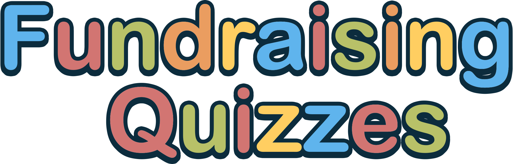

## 

This repository contains the source code for [fundraisingquizzes.net](https://www.fundraisingquizzes.net), a charity based quiz-site.

This website was created for my mother, who still runs the website herself today. :)

Originally written in PHP in 2013, 12 years later, it was the last website running on a server that was scheduled to be decommissioned.

The website is important to my mother and still had an active userbase, therefore rather than retire it into the sunset, I rewrote it TypeScript/Bun and modernized the codebase, giving it a new lease on life.